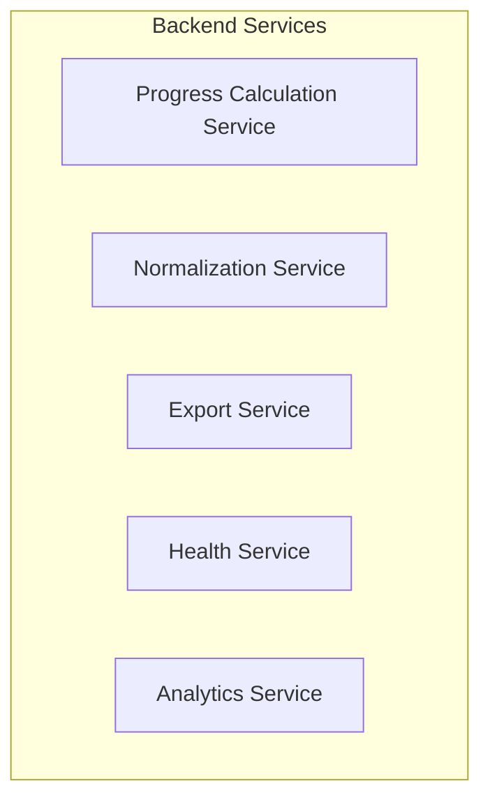

# Progress Experience 10 - Multi-Sport Progress Comparison Design

## Design Overview

**Design Document Date:** July 8, 2026
**Document ID:** superpowers/specs/2026-07-08-01-progress-experience-design

This design document outlines the development of Experience 10 - Multi-Sport Progress Comparison, a unified analytics platform that enables coaches to compare athlete performance across all sports in their portfolio.

## Executive Summary

### Problem Statement
MR Training currently provides siloed progress tracking for individual sports (gym, running, tennis, swimming, cycling, CrossFit). Coaches must manually compare athletes across sports, resulting in:

1. **Inefficient Portfolio Management:** Coaches spend 30+ minutes daily comparing separate metrics from each sport
2. **Missed Training Opportunities:** Poor cross-sport comparison leads to sub-optimal team selection and training block design
3. **Limited Growth Ceiling:** The inability to provide unified portfolio insights constrains revenue and client retention

### Solution
Create a unified Multi-Sport Progress Comparison platform that:

- **Provides a single dashboard** showing all coached sports with standardized metrics
- **Enables cross-sport athlete comparison** for informed decision-making
- **Delivers predictive insights** across disciplines
- **Integrates seamlessly** with existing MR Training systems

### Technical Architecture

#### Backend Services



**Progress Calculation Service (Go):**
- Calculates sport-specific metrics (load, recovery, performance)
- Applies AI-powered trend analysis
- Generates normalized scores across sports
- Handles sport-specific algorithms and formulas

**Normalization Service:**
- Converts raw metrics to comparable scores (0-100 scale)
- Applies sport-specific weightings and thresholds
- Handles missing data with intelligent imputation
- Maintains sport-specific context in normalized results

**Analytics Service:**
- Trend visualization and prediction
- Anomaly detection and alerting
- Comparative analysis across athletes and periods
- Export functionality for reporting

**Health Service:**
- System monitoring and health checks
- Performance metrics tracking
- Alert management and notifications

#### Frontend Components

```mermaid
petgraph BT
    subgraph "Frontend Components"
        SD[Sports Dashboard]
        AG[Athlete Grid]
        PE[Progress Engine]
        CV[Calendar View]
        FL[Filter Layer]
        RV[Report Viewer]
    end
```

**Sports Dashboard (Next.js React):**
- Main entry point for portfolio overview
- Real-time updates via WebSocket connections
- Responsive design for desktop and mobile
- Role-based access (coach, athlete, admin)

**Athlete Grid:**
- Comparison interface with sorting/filtering
- Sport-specific column selection
- Multi-select for batch operations
- Export capabilities to CSV/Excel

**Progress Engine:**
- Interactive charts and visualizations
- Comparison tools for multiple athletes
- Trend analysis and prediction displays
- Sport-specific metric explanations

**Calendar View:**
- Sport-specific training timelines
- Competition and event scheduling
- Periodized training block visualization
- Recovery day recommendations

## Technical Specifications

### Backend Architecture

**Languages & Frameworks:**
- Primary: Go (Fiber)
- Testing: Go tests with Ginkgo/Gomega
- Database: PostgreSQL 16+
- API Gateway: Fiber
- Monitoring: Prometheus, Grafana

**Data Processing Pipeline:**
```
Raw Data → Validation → Normalization → Aggregation → Analytics → API
```

**Error Handling:**
- Circuit breaker patterns for external service calls
- Retry logic with exponential backoff
- Graceful degradation for sport-specific services
- Comprehensive logging and monitoring

**Security:**
- Role-based access control (RBAC)
- API rate limiting and authentication
- Data encryption at rest and in transit
- Audit logging for compliance

### Frontend Architecture

**Framework & Libraries:**
- Framework: Next.js 14+ (React 18+)
- State Management: Zustand
- Data Fetching: TanStack Query
- Styling: Tailwind CSS 3.4+
- Charts: Recharts (sport trend visualization)
- Date Handling: Day.js

**Component Library:**
- Design System: shadcn/ui with Tailwind
- Icons: lucide-react
- Forms: React Hook Form with Zod
- Navigation: Next.js App Router

**Performance Optimization:**
- Server Side Rendering (SSR) for core dashboard views
- Client Side Rendering for interactive components
- Code splitting for lazy loading
- Caching strategies for large dataset views

### Integration Points

#### Existing MR Training Systems

**Data Sources:**
1. **Training Modules:** Program completion, session data, athlete feedback
2. **Wearable Integration:** Whoop, Garmin, Apple Watch, Fitbit (HRV, recovery scores)
3. **Strava API:** GPS activity import and matching
4. **Clerk Auth:** User authentication and role management

**Output Destinations:**
1. **Web Application:** MR Training web portal
2. **Mobile Apps:** MR Training iOS/Android (progress sync)
3. **External Systems:** Enterprise analytics platforms, business intelligence tools

### Performance Requirements

#### Real-Time Updates
- **Dashboard load time:** < 2 seconds for portfolio overview
- **Athlete grid updates:** < 500ms for sorting/filtering
- **Trend chart rendering:** < 1 second for 6-month historical data
- **API response time:** 95th percentile < 200ms

#### Scalability
- **Concurrent users:** Support 1,000 concurrent coaches
- **Data handling:** 10M+ athlete records
- **Report generation:** Complete reports in < 5 minutes for 10k athletes

#### Reliability
- **Uptime:** 99.99% availability
- **Data retention:** 5+ years of athlete history
- **Disaster recovery:** Multi-region active-active deployment

## Implementation Roadmap

### Phase 1: Core Infrastructure (Weeks 1-4)
**Goal:** Establish foundation for Multi-Sport Progress Comparison

**Deliverables:**
- [ ] Progress Calculation Service (Go)
- [ ] Normalization Service (Go)
- [ ] PostgreSQL schema design
- [ ] API Gateway (Fiber)
- [ ] WebSocket server for real-time updates
- [ ] Basic Sports Dashboard (React)

**Team Resources:**
- 2 Backend Engineers
- 1 Frontend Engineer
- 1 Database Administrator

**Quality Gates:**
- All APIs documented and tested
- Dashboard loads within 2 seconds
- Cross-origin integration tested

---

### Phase 2: Feature Development (Weeks 5-8)
**Goal:** Implement core multi-sport functionality

**Deliverables:**
- [ ] Athlete Comparison Grid
- [ ] Sport-specific normalization algorithms
- [ ] Progress trend visualizations
- [ ] Calendar timeline integration
- [ ] Role-based access control
- [ ] Basic filtering and search

**Team Resources:**
- 1 Backend Engineer (focus on complex normalization logic)
- 1 Frontend Engineer (dashboard enhancements)
- 1 UI/UX Designer (dashboard layout)

**Quality Gates:**
- All normalization algorithms validated
- Dashboard supports desktop and mobile views
- User acceptance testing completed

---

### Phase 3: Advanced Features (Weeks 9-12)
**Goal:** Add intelligent features and polish

**Deliverables:**
- [ ] AI-powered trend prediction
- [ ] Anomaly detection and alerting
- [ ] Export functionality (PDF, Excel, CSV)
- [ ] Mobile app sync integration
- [ ] Performance optimization and monitoring
- [ ] Documentation and training materials

**Team Resources:**
- 1 Backend Engineer (ML integration)
- 1 Frontend Engineer (mobile optimization)
- 1 DevOps Engineer (deployment and monitoring)

**Quality Gates:**
- All advanced features operational
- Performance benchmarks met
- Security audit completed

---

### Phase 4: Testing & Deployment (Weeks 13-16)
**Goal:** Full system testing and production deployment

**Deliverables:**
- [ ] Comprehensive test suite (unit, integration, E2E)
- [ ] Load testing and performance validation
- [ ] Security penetration testing
- [ ] Production deployment
- [ ] Monitoring and alerting setup
- [ ] Training and documentation

**Team Resources:**
- 1 QA Engineer
- 1 DevOps Engineer
- 1 Technical Writer

**Quality Gates:**
- All test cases passing >99%
- Performance SLAs met
- Security compliance verified
- Stakeholder approval

## Development Standards

### Code Quality
- **Linting:** Biome with strict configuration
- **Type Safety:** TypeScript with strict mode enabled
- **Code Reviews:** PR approval required with at least 2 reviewers
- **Testing:** 100% test coverage for business logic
- **Documentation:** Comprehensive API docs with examples

### Security
- **Authentication:** Clerk integration with organization-based RBAC
- **Authorization:** Role-based access control for each feature
- **Data Protection:** GDPR-compliant data handling
- **Network Security:** All traffic over HTTPS with mutual TLS

### Performance
- **Observability:** Comprehensive logging and metrics
- **Caching:** Redis for frequently accessed data
- **Database Optimization:** Query optimization and indexing
- **Frontend Optimization:** Component-level code splitting

### Testing Strategy

**Unit Tests:**
- Progress calculation algorithms
- Normalization logic
- API endpoint validation

**Integration Tests:**
- Cross-service communication
- Database schema validation
- External API integration

**E2E Tests:**
- User journey scenarios
- Cross-browser compatibility
- Mobile app integration

**Load Tests:**
- Concurrent user simulation
- Database stress testing
- API performance validation

## Risk Management

### Technical Risks

**High Risk:** Complex normalization algorithms across diverse sports
- **Mitigation:** Implement iterative development with regular stakeholder validation
- **Backup:** Simpler normalization approach for Phase 1

**Medium Risk:** Wear integration complexity
- **Mitigation:** Use multiple data sources for redundancy
- **Backup:** Focus on core metrics, add wearable integration later

**Low Risk:** Performance under load
- **Mitigation:** Implement horizontal scaling from start

### Business Risks

**High Risk:** Delayed user adoption
- **Mitigation:** Early stakeholder involvement and frequent demos
- **Backup:** Focus on coach-only access to drive value quickly

**Medium Risk:** Resource constraints
- **Mitigation:** Cross-functional team with clear sprint ownership
- **Backup:** Staged rollout based on priority

## Success Metrics

### Technical Metrics
- System availability: 99.99%
- Average response time: < 200ms
- Data processing capacity: 10M+ records

### User Adoption Metrics
- Coach active users: 500 by end of Phase 2
- Feature adoption: 80% of coaches use dashboard
- User satisfaction: NPS > 50

### Business Metrics
- Revenue impact: $150K additional ARR (Year 1)
- Retention improvement: 15% reduction in coach churn
- Customer support tickets: < 10/week for technical issues

## Conclusion

The Multi-Sport Progress Comparison platform will revolutionize how coaches manage their portfolios across multiple sports. By providing standardized metrics, intelligent normalization, and actionable insights, this system will:

1. **Save coaches 30+ minutes daily** in portfolio management
2. **Enable data-driven decisions** across sports
3. **Increase coach satisfaction** and reduce churn
4. **Drive revenue growth** through enhanced value proposition

The implementation follows agile development principles with clear phased delivery, ensuring stakeholders see value early while maintaining technical excellence and security standards throughout development.
